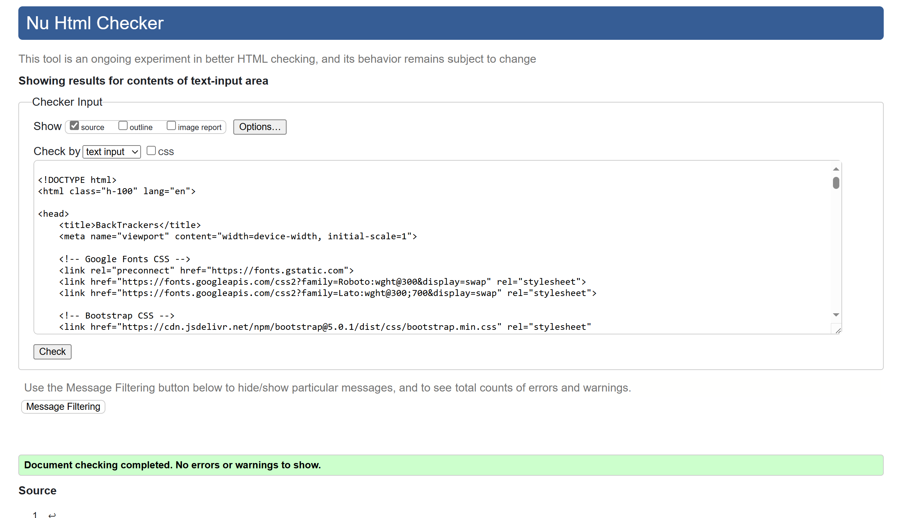
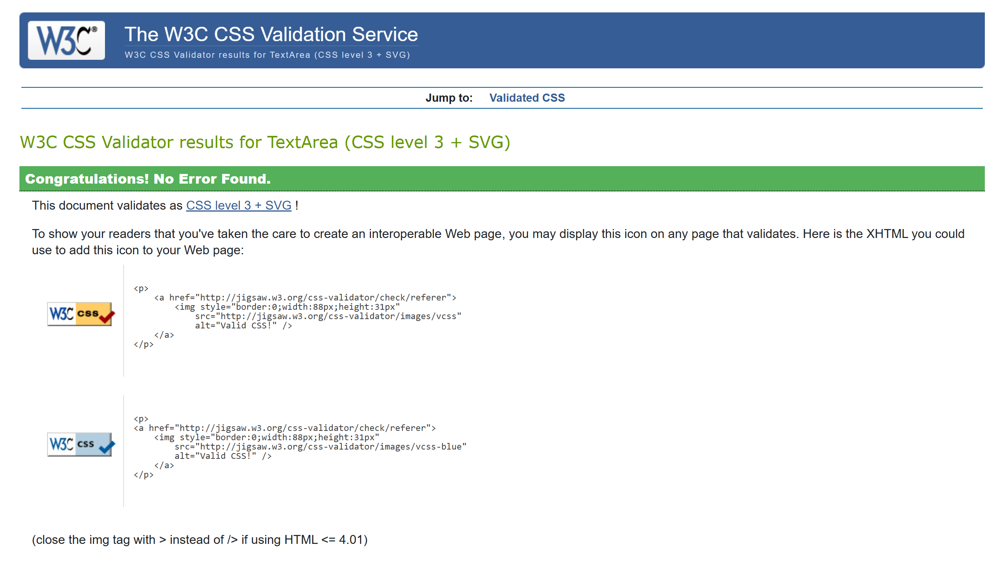
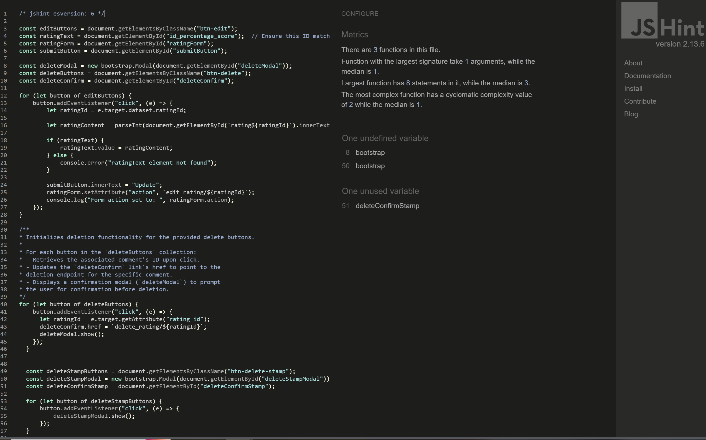
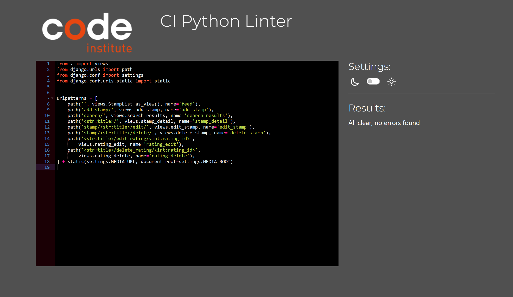

# Testing

TESTING file for [BackTracker](https://back-tracker-9bf98d85163a.herokuapp.com/) website.

Return to the [README.md](README.md).

## Contents  
  
- [Testing](#testing)
  - [Contents](#contents)
  - [Validation](#validation)
    - [HTML - W3C Validator](#html---w3c-validator)
    - [CSS - W3C Validator](#css---w3c-validator)
    - [JavaScript - JS Hint](#javascript---js-hint)
    - [Python - CI Python Linter](#python---ci-python-linter)
  - [Manual Testing](#manual-testing)
    - [User Input/Form Validation](#user-inputform-validation)
    - [Browser Compatibility](#browser-compatibility)
    - [Dev Tools \& Physical Device Testing](#dev-tools--physical-device-testing)
  - [Bugs](#bugs)

## Validation

### HTML - W3C Validator
Due to the use of Django all of the html files contain some Jinja syntax and fail the validator if applied raw. However by right-clicking on the deployed Heroku site and inspecting page it was possible to extract just the html code to be passed through the W3C HTML validator.

All HTML pages were validated and received a 'No errors or warnings to show' result as shown above for the home page. See following links for checks on remianing html docs:
- [login](static/images/sign_in.png)
- [feed](static/images/stamp_feed.png)
- [add stamp](static/images/add_stamp.png)
- [stamp detail](static/images/stamp_detail.png)
- [country search](static/images/country_search.png)
- [gallery](static/images/gallery.png)
- [logout](static/images/sign_out.png)

### CSS - W3C Validator
CSS was validated via the W3C Jigsaw CSS validator and returned no errors for my style.css file:

### JavaScript - JS Hint
My ratings.js file passed through JS Hint without errors or warnings:

### Python - CI Python Linter
I used CI Python Linter to check all Python code that I contributed to. Below is the validation run on my project urls file (back_tracker/urls.py) followed by links to all other .py file checks.

__Back_Tracker project__ 
- [settings](static/images/B_T_settings.png)

__Home__
- [forms](static/images/home_forms.png)
- [models](static/images/home_models.png)
- [urls](static/images/home_urls.png)
- [views](static/images/home_views.png)

__Blog__
- [admin](static/images/blog_admin.png)
- [forms](static/images/blog_forms.png)
- [models](static/images/blog_models.png)
- [urls](static/images/blog_urls.png)
- [views](static/images/blog_views.png)

__Gallery__
- [urls](static/images/gallery_urls.png)
- [views](static/images/gallery_views.png)

__[env](static/images/env.png)__

## Manual Testing

### User Input/Form Validation

Testing was carried out on edge and chrome across multiple devices and multiple people.

| Feature                    | Tested?  | User Input Required | User Feedback Provided     | Pass/Fail | Fix |
|----------------------------|----------|---------------------|----------------------------|-----------|-----|
| Navbar Links | Yes | Click | Links takes user to eponymous pages, the plsu icon takes user to add stamp page. Tooltips used in desktop/mobile view to provide accessibility and condensed navbar via burger toggle | Pass | - |
| Home Page Country Search | Yes | Click | Users are taken to a page displaying the stamps from the country searched | Pass | - |
| Sign Up Page               | Yes      | Email/Username/Password | Empty fields deliver prompt to user, email field optional | Pass | - |
| Sign In | Yes | Username and Password | Username/Password must be exactly as registered originally in either lowercase/uppercase or mixture | Pass | - |
| Add Stamp (Registered User) | Yes | Mixture of required image/text fields | Fields are required to be populated before submitting which then takes the user back to the feed | Pass | - |
| Rating (Registered User) | Yes | Int accepted between 0 and 100 | User is informed that their rating is submitted | Pass | - |
| Edit Stamp (Registered User) | Yes | Image/Text fields and click "submit" or "return to feed" | Changes made to Stamp are saved and displayed or user is directed back to feed | Pass | - |
| Delete Stamp (Registered User) | Yes | Click button to choose 'Yes, delete' or click the cross | Stamp is deleted or user returns to stamp detail | Pass | - |
| Delete Rating (Registered, User) | Yes | Click button to choose 'Delete' or click cross to close | Rating is deleted or user returns to stamp detail | Pass | - |
| Edit Rating (Registered User)| Yes | Text fields | User may update rating to be saved | Fail | - |
| Sign Out (Registered User) | Yes | Click to choose 'Sign Out' or use the navbar links | User is signed out and informed by message on screen, or directed to the page they click in the navbar, still logged in | Fail | - |

### Browser Compatibility

BackTrackers was tested on the following browsers, new users were created, old users data edited and all features were tested:

- Chrome
- Edge

### Dev Tools & Physical Device Testing

Responsivess testing was carried out using dev tools to manipulate the screen size and also across mutliple physical devices successfully. These included:
- Android phone
- iPhone
- Chromebook
- Windows Surface
- MacBook
- Large Monitor

## Bugs

 - When signing out there is no confirmation message
 - The edit rating functionality is not working
 - The country search returns a page with the country initials rather than full country name
 - User profile link was returning errors and has been hidden from the navbar
 - Gallery link returning errors for users not logged in and should be hidden until logged in
