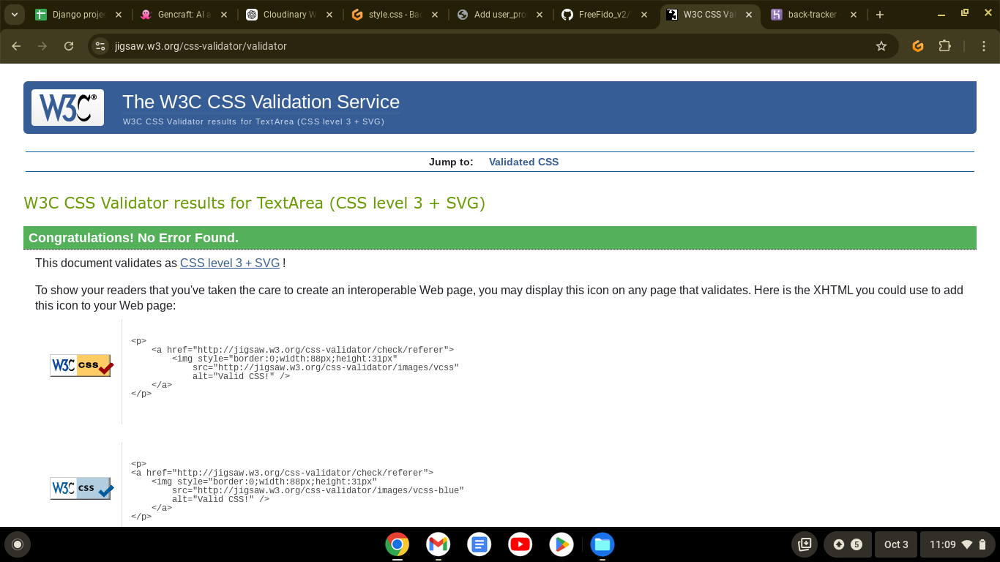
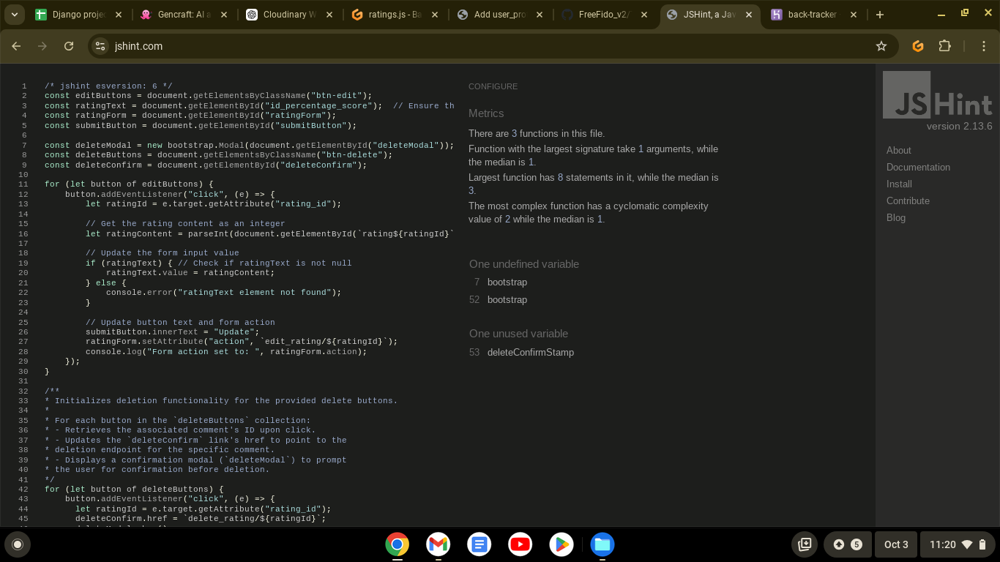
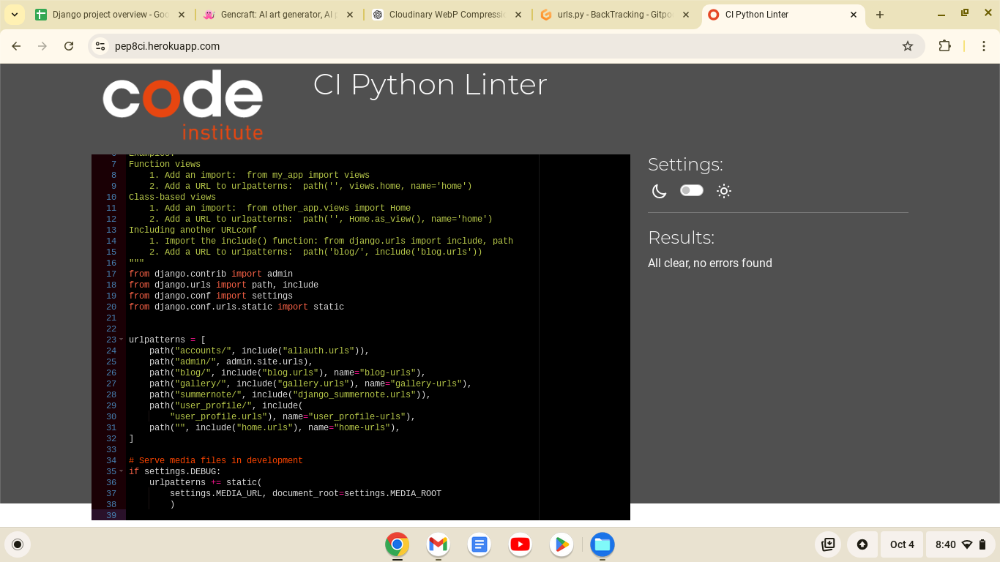

# Testing

TESTING file for [BackTracker](https://back-tracker-9bf98d85163a.herokuapp.com/) website.

Return to the [README.md](README.md).

## Contents  
  
- [Testing](#testing)
  - [Contents](#contents)
  - [Validation](#validation)
    - [HTML - W3C Validator](#html---w3c-validator)
    - [CSS - W3C Validator](#css---w3c-validator)
    - [JavaScript - JS Hint](#javascript---js-hint)
    - [Python - CI Python Linter](#python---ci-python-linter)
  - [Manual Testing](#manual-testing)
  - [Bugs](#bugs)

## Validation

### HTML - W3C Validator
Due to the use of Django all of the html files contain some Jinja syntax and fail the validator if applied raw. However by right-clicking on the deployed Heroku site and inspecting page it was possible to extract just the html code to be passed through the W3C HTML validator.

All HTML pages were validated and received a 'No errors or warning to show' result as shown above for the home page. See following links for checks on remianing html docs:

### CSS - W3C Validator
CSS was validated via the W3C Jigsaw CSS validator and returned no errors for my style.css file:

### JavaScript - JS Hint
My ratings.js file passed through JS Hint without errors or warnings:

### Python - CI Python Linter
I used CI Python Linter to check all Python code that I contributed to. Below is the validation run on my project urls file (back_tracker/urls.py) followed by links to all other .py file checks.

Back_Tracker project - settings.py

## Manual Testing

## Bugs